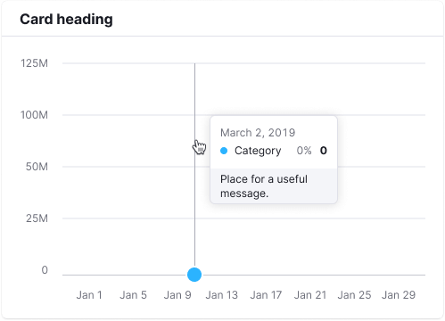

@## Chart widget anatomy

In our interfaces, data is usually placed in [cards](/components/card/), which consist of:

1. Heading (`margin-bottom: 8px;`)
2. Additional information under the heading (`margin-bottom: 8px;`) — _optional_
3. General widget controls (export or view settings, etc.) — _optional_
4. [Divider](/components/divider/)
5. Top controls (filters, buttons, etc.) — _optional_
6. Chart — axes, values and chart itself (`margin-top: 20px;`)
7. Bottom controls (`margin-top: 20px;`) — _optional_

> Optional paragraphs mean that their presence depends on the case you are solving in your interface.

@## Title and additional information

**The chart shall have a title** which briefly and clearly indicates what data is shown on the chart. If the chart belongs to a table or [Summary](/patterns/summary/), and the title is far from the chart, then keep an eye on the indents between widgets. The user shall clearly understand what data is on the chart.

- The title can be clickable.
- Place [InfoM](/style/icon/) icon next to the title.

| Appearance                           | Styles                                                                                                                                                                                                                                  |
| ------------------------------------ | --------------------------------------------------------------------------------------------------------------------------------------------------------------------------------------------------------------------------------------- |
|  | For chart title use 16px text (`--fs-300`, `--lh-300`, `font-weight: bold;`) and `--gray800` color. `InfoM` icon has `--gray300` color and `margin-left: 4px`. The clickable title `hover` matches the [link hover](/components/link/). |

**The title may have an additional information.** It usually contains information about maximum/minimum data statuses or explanation of what the data is based on, etc. Or some interesting insight/advice for the visualized data.

| Appearance                             | Styles                                                                     |
| -------------------------------------- | -------------------------------------------------------------------------- |
|  | For subtitle use 14px text (`--fs-200`, `--lh-200`) and `--gray500` color. |

@## Chart controls

For detailed information about chart controls, see [Chart controls](/data-display/chart-controls/).

@## Collapsing rows

You can collapse card rows if necessary. See more information in the [Chart controls](/data-display/chart-controls/#adbaac) guide.

@## Legend

**Legend** is an additional visual information that explains the data on the chart.

The legend can work as a filter or be unclickable representation of the data below. For more information about the legend and its types, see [Chart legend](/data-display/chart-legend/).

@## Grid and axes

**Axes** should help user navigate the data and relate values to each other.

> 💡 Please don't make the additional lines bright and colored — the emphasis should be on the data, not on the grid.

- The **Y axis** is hidden by default.
- The color of additional axes is `--gray100`.
- Color of the X axis and additional active lines on the grid (if available) — `--gray200`.
- left and right margin to the Y axis values is 16px.
- `margin-top` to the X axis values is 12px.

### Minimum and maximum number of axes

To make it easier to track changes, use 3-5 additional horizontal guides. Round the values on the axes, like _25K − 20K − 15K − 10K_, instead of using exact values like _24.8K − 20.0K − 15.2K − 10.2K_.

> 💡 **The recommended minimum height of the chart is 118px.** For such a chart, it is recommended to display 3 additional horizontal guides. Keep in mind that it can be difficult to read changes on the charts that has such small height.

Minimum (small) chart height has 3 additional horizontal guides.

**The maximum height of the chart is up to your case.** For high-height charts, use no more than 5-6 additional horizontal guides.

@## Tooltip

When hovering over any part of the chart, a tooltip is displayed with data for the point/points over which the cursor is located. The tooltip is displayed even for the points where there is no data.

In this case, we put `n/a` instead of the value and recommend adding a note about the forecast.

The tooltip appears next to the cursor. It does not overlap the guides and active points. It is always located inside the chart container. _In other words, if the point is near the upper or lower border of the chart area, the tooltip is positioned within the chart area._

- The tooltip shows data for all the lines for the selected date.
- For tooltip title use the date or project name. For easy comparison, the values shall be right-aligned.
- The tooltip can contain the total value.
- If several charts have the same timeline under each other, then they can be synchronized — when you hover over one of the charts, the hover is triggered on the other. This is quite useful for comparing data.

> As a rule, we do not put the measurement unit for the values inside the tooltip (it should be clear from the chart name and the axes). However, in some complex charts such as scatterplot and the like, a measurement unit can be added to make data reading more easy.

### Styles and margins

- The data tooltip shall always be displayed relative to the point with an 8px margin. The inner tooltip padding is 12px.
- The color for the additional vertical line that appears on line charts when hovering is `--gray300`. The background color that appears on bar charts is `--gray200` with 30% transparency.

|                          | Appearance                               | Styles                                                                                                                                                                                                                                    |
| ------------------------ | ---------------------------------------- | ----------------------------------------------------------------------------------------------------------------------------------------------------------------------------------------------------------------------------------------- |
| One point                |          | The default point size is `12px * 12px` (plus a 2px border). The size of the hover point is `16px * 16px`.                                                                                                                                |
| Several points           |        |
| n/a                      |    | To show not available data use dashed line.                                                                                                                                                                                               |
| Start of data collecting |  | Designation of the data collection start point: dashed line with a 16px \* 16px point, the color of the point corresponds to the legend. In the tooltip, the text about the beginning of data collection is 12px, the color is `$gray60`. |

@## Trend and average value
To display the trend line or average value on the chart, we use gray colour with styles: `border: solid 2px var(--wall)`. Similarly, we can also display total values.

- Points on the line are optional.
- The legend must have a checkbox for the trend line. On the charts, the universal color for the checkbox is `--var(wall)`.

@## Data loading

During primary data loading, the widget displays the [Skeleton](/components/skeleton/) in place of the chart.

If the chart has a title, it should be displayed during loading. The user shall have an idea of what is being loaded and whether they need to wait for the loading process to complete.

> 💡 Note that every chart has it's own skeleton. For more information see guides for evety chart type.

@## Edge cases

The state for one, two, zero, and partial values differ for different chart types, and these states shall be checked in the documentation for respective chart types.

General rules of "empty" states for widgets with charts are described in [Error & n/a widget states](/components/widget-empty/).

@page chart-code
